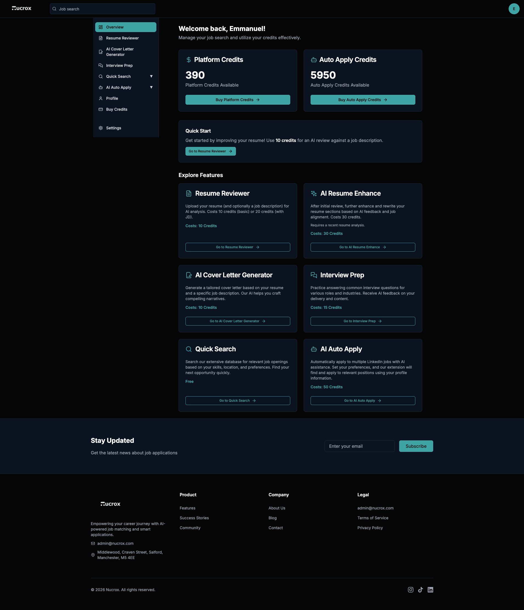
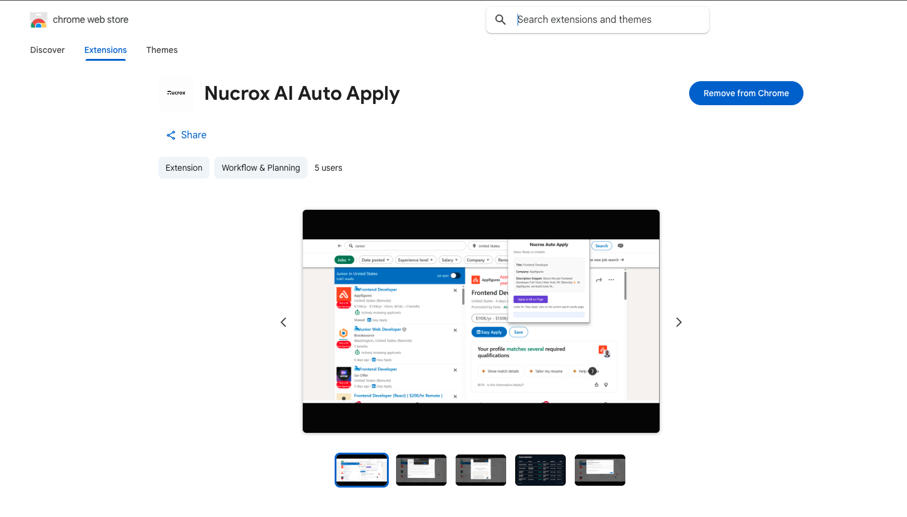
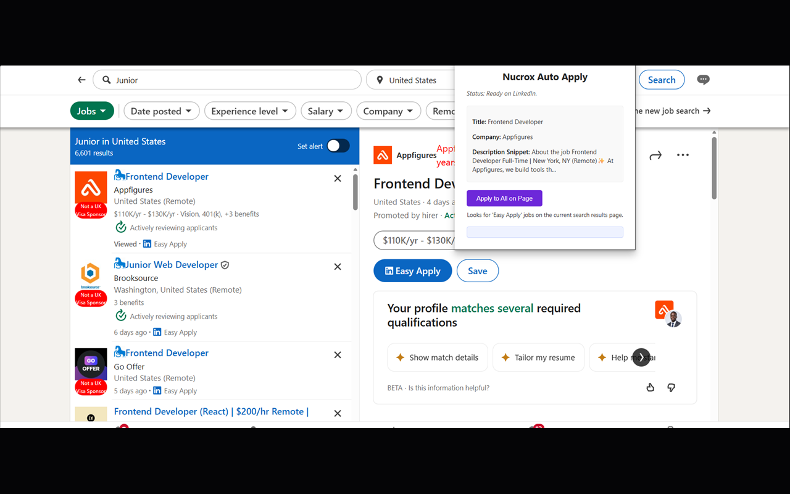
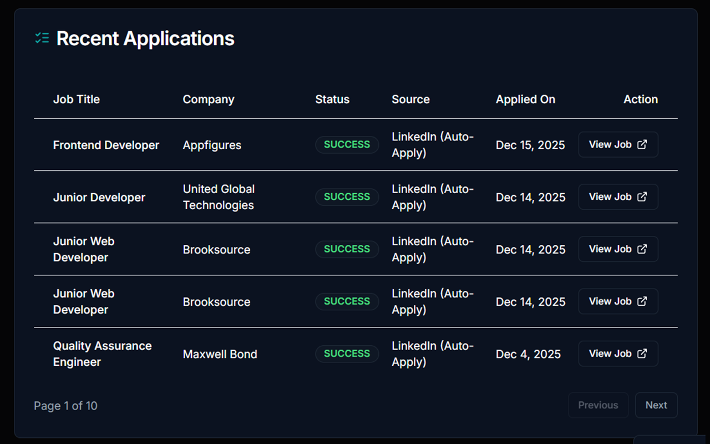

# Nucrox (NextJobQuest) - System Architecture Overview

**Role:** Founding Engineer & Lead Architect  
**Status:** Production (Private Repository due to Proprietary IP)

## Executive Summary
Nucrox is a comprehensive, monetized AI career suite serving active users. The platform integrates a Next.js 14 web application, a secure cross-origin Chrome Extension, and a Retrieval-Augmented Generation (RAG) pipeline to automate job applications and generate context-aware career materials.

This repository serves as a high-level architectural overview of the systems, data pipelines, and microservices powering the platform.

## 1. Core Technology Stack
* **Framework:** Next.js 14 (App Router), React 18, TypeScript 5
* **Database & Auth:** Supabase, Prisma ORM (PostgreSQL), Firebase, NextAuth
* **AI Infrastructure:** Google Generative AI (Gemini), Groq SDK, Vapi.ai (Voice Native AI)
* **Monetization & Ledger:** Stripe API, custom atomic credit-ledger system
* **Content & Assets:** Sanity CMS, Cloudinary, AWS (PDF processing)

## 2. Architectural Highlights

### A. The Cross-Origin Chrome Extension Pipeline
To enable the "Auto-Apply" feature, I architected a custom Chrome Extension (`@types/chrome`) that acts as the execution arm of the web application.
* **Mechanism:** The extension injects content scripts into target domains (e.g., LinkedIn).
* **State Sync:** It communicates securely via cross-origin messaging with the Next.js backend, fetching the user's parsed resume context and authentication tokens.
* **DOM Manipulation:** Executes precise, automated DOM targeting to map user data to complex application forms in real-time.

### B. Retrieval-Augmented Generation (RAG) Engine
The platform dynamically generates cover letters and interview prep materials based on strict user context to prevent LLM hallucination.
* **Ingestion:** User PDFs are uploaded, sanitized, and parsed via `pdf-lib` and `pdf2json`.
* **Orchestration:** Extracted text is fed into the Google Generative AI pipeline alongside strictly typed system prompts.
* **Streaming:** Responses are streamed back to the client using Server-Sent Events (SSE) to ensure a low-latency (sub-2s) user experience during generation.

### C. Voice-Native AI Interview Coach
Integrated `@vapi-ai/web` to build a low-latency conversational agent. The system handles real-time WebRTC audio streams, passing transcripts to the LLM backend for dynamic, context-aware interview simulations.

### D. Credit-Based Economy & Monetization
Built a durable ledger system to manage platform usage.
* **Transactions:** Stripe webhooks trigger Supabase edge functions to atomically update a user's credit balance.
* **Validation:** Every AI generation request is middleware-validated against the user's current token ledger, ensuring zero leakage of API compute costs.

## 3. UI/UX & Performance Optimization
* Achieved a 98/100 Lighthouse score through aggressive Server-Side Rendering (SSR) and edge caching.
* Complex state management handled via React Context and highly modularized Tailwind CSS / Radix UI components (`@radix-ui/react-*`).
* Client-side document generation using `@react-pdf/renderer` and `html2canvas`.

## 4. Visual Architecture Proof

### Platform Dashboard & Atomic Credit Ledger
*Validates the UI state management and integration of the Supabase/PostgreSQL credit economy.*

### Chrome Web Store Deployment
*Validates production-level browser extension deployment and Google Web Store compliance.*

### Cross-Origin DOM Manipulation (LinkedIn Integration)
*Validates the execution of injected content scripts and secure data mapping on third-party domains.*

### End-to-End Execution & Application Tracking
*Validates the successful execution of the cross-origin extension and persistent database tracking of automated pipelines.*

---
*Note: Due to the commercial nature of this product, the source code remains strictly confidential. I am available to provide a guided technical walkthrough of the codebase, database schemas, and Next.js routing logic under NDA.*
